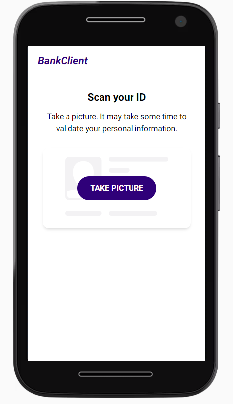

# Z1 Frontend developer test - Leire

Para realizar la prueba he utilizado **React** mediante **create-react-app** y la template de **TypeScript** como esqueleto de la aplicación. Además, he instalado y utilizado las siguientes dependencias:

- **node-sass**: para poder trabajar con SCSS usando variables, nesting, mixins, etc.
- **react-webcam**: para detectar y activar la cámara del PC del usuario.
- **react-router-dom**: para definir la estructura de las páginas y su enrutado.

La app consiste en un **escáner** que analiza y valida un documento de identidad del usuario activando la webcam del ordenador.

Por el momento solo está disponible en versión mobile, y ha sido desarrollada siguiendo los estilos definidos por un prototipo dado en **InVision**.

## Resultado

## Available Scripts

In the project directory, you can run:

### `npm start`

Runs the app in the development mode.\
Open [http://localhost:3000](http://localhost:3000) to view it in the browser.

The page will reload if you make edits.\
You will also see any lint errors in the console.

### `npm test`

Launches the test runner in the interactive watch mode.\
See the section about [running tests](https://facebook.github.io/create-react-app/docs/running-tests) for more information.

